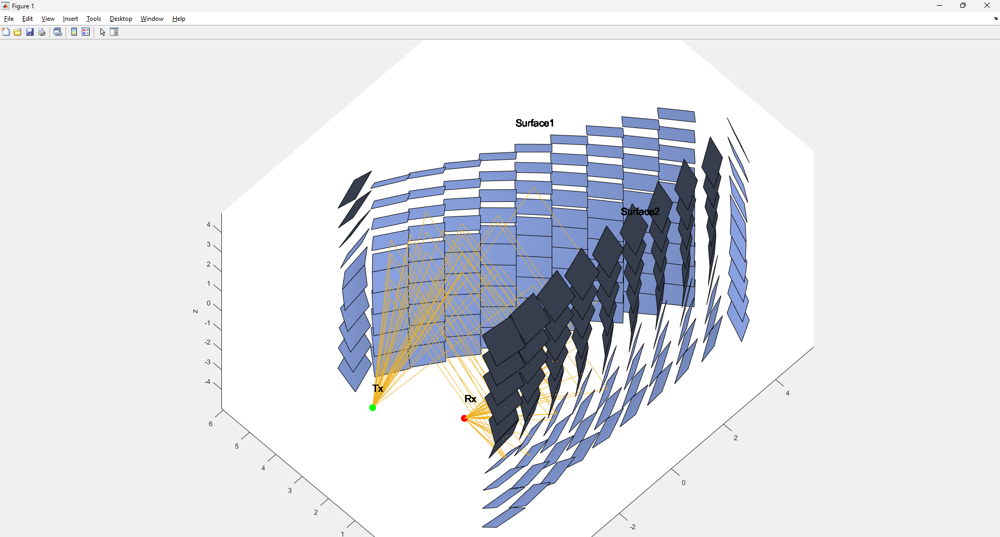
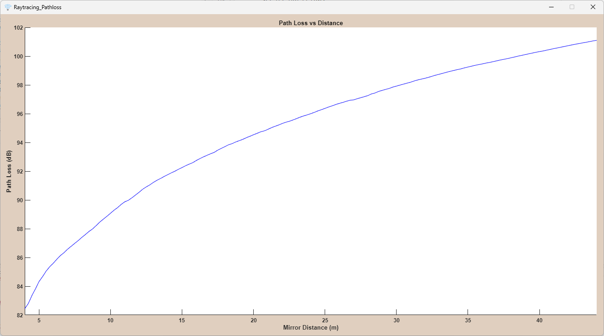

# Inter-surface path loss modelling in 6G communications

Nowadays multiple devices need to connect to the internet. Many of them need to comunicate through wireless means and so we need to improve the quality of such communications. Additionally, Internet protocols are evolving, and 6G is now available. Μorphologies of the environment tend to reduce the performance of wireless communications. A new technology called Meta-surfaces has come to increase the reliability and security of any communication. By utilizing such Meta-surfaces, the maximum distance restrictions associated with 6G can also be overcome and Non-Line of Site (NLOS) issues can be solved. 

## About The Project

This project simulates the behavior of communication between a Transmitter (Tx) and a Receiver (Rx) adding two meta-surfaces in between. The simulation uses Ray Tracing techniques to simulate the communication. The communication path begins from the Transmitter when it sends multiple rays in every direction. Then some of the rays gets reflected from the first meta-surface at the beginning and then gets reflected by the second meta-surface. Finally, some rays reache the Receiver.

At the end of simulation, useful plots are displayed that presends the Path Loss between the two meta-surfaces, the RMSE and an exponent "n" of the general Path Loss Equation. 

## Meta-surfaces

Meta-surfaces refers to a kind of artificial sheet material with sub-wavelength thickness. Meta-surfaces modulate the behaviors of electromagnetic waves through specific boundary conditions. They can manage the beams of a Trasmitter and can be controlled to customise the behaviour of a wireless communication. In this project we assume that Meta-surfaces have square shape and they can reflect signals with zero loss. A group of unit cells surfaces placed in a grid, forms a meta-surface.

## Path Loss Model

In this project we assume that the communication follows the Friis equation between each stage. Because of the Meta-surfaces, the Path Loss between them is going to have strange behavior and that is what this project is looking for. In general form of Path Loss equation, the exponent "n" is typically equals to 2 in Free Space Path Loss but using Meta-surfaces this exponent tends to be differend. For short distances the exponent "n" is less than 2 and for long distances, this exponent is almost equal to 2.

## Ray Tracing

Ray Tracing tenchniques are used to simulate the overal communication. The Meta-surfaces have square shape and for this reason we use Ray Tracing specifically for squares. (An inmplementaion for rectangles will also to the job but decreases the performance). GPU is being used to increase the overal performance.

### Execution

The project is implemented in Matlab. The user need to run the startProgram.m file. A GUI will pop-up and user can change multiple parameters to his needs.

## GUI

The user can setup the environment that contains the Transmitter, the Receiver and the two Meta-surfaces.
* It is possible to set the positioning of the Transmitter and Receiver and also Transmitter Power.
* On each Meta-surface setting panel, user can customize the positioning, the angles and the size of the Meta-surface.
* In general tab, user can set the Frequency of the radiowaves and also the number of the cells surfaces that forms the grid of Meta-surfaces by choosing the number of elements in one side.

On Main Menu user can:
 * Set the number of Rays that Transmitter casts for each cell surface on the Meta-surface grid.
 * Plot the scene and visualize the environment
 * Begin Ray Tracing
 * Analyze the data

## Contact

Georgoulas Dimosthenis - dimosgeo99@gmail.com - dgeorgoulas@cs.uoi.gr

Project Link: <a>https://github.com/dimosgeo/Inter-surface-Path-Loss-Modeling</a>
